<!-- README.md is generated from README.Rmd. Please edit that file -->

# TALL - Text Analysis for ALL

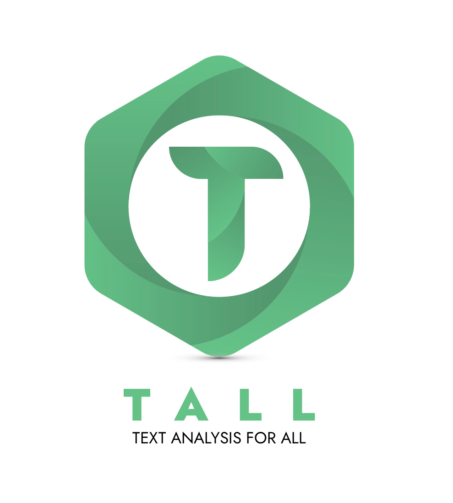

<!-- badges: start -->

[](https://CRAN.R-project.org/package=tall)
[](https://CRAN.R-project.org/package=tall)
<!-- badges: end -->

TALL (Text Analysis for ALL) is an interactive R Shiny application
designed for exploring, modeling, and visualizing textual data. It
provides a comprehensive, code-free environment for Natural Language
Processing, enabling researchers without extensive programming skills to
perform sophisticated text analyses through an intuitive graphical
interface.

TALL integrates state-of-the-art NLP techniques — tokenization,
lemmatization, Part-of-Speech tagging, dependency parsing, topic
modeling, sentiment analysis, and more — into a unified, reproducible
workflow.

------------------------------------------------------------------------

## Reference Paper

> **Aria, M., Spano, M., D’Aniello, L., Cuccurullo, C., & Misuraca, M.**
> (2026). TALL: Text analysis for all — an interactive R-shiny
> application for exploring, modeling, and visualizing textual data.
> *SoftwareX*, 34, 102590.

**[Read the full paper (Open
Access)](https://www.sciencedirect.com/science/article/pii/S2352711026000841)**
\| **[Supplementary
material](https://ars.els-cdn.com/content/image/1-s2.0-S2352711026000841-mmc1.pdf)**

When using TALL in a publication, please cite the reference above.

------------------------------------------------------------------------

## Setup

### System Requirements

Before installing TALL, ensure you have:

1.  **R version 4.2.0 or higher** — Download from
    [CRAN](https://cran.r-project.org/)
2.  **RStudio** (recommended) — Available at
    [Posit](https://posit.co/download/rstudio/)
3.  **Active internet connection** for downloads and dependencies
4.  **Additional tools for the development version:**
    - Windows: [Rtools](https://cran.r-project.org/bin/windows/Rtools/)
    - Mac: Xcode Command Line Tools

### Stable Version (CRAN)

``` r
install.packages("tall")
library(tall)
tall()
```

### Development Version (GitHub)

First, verify your build tools:

``` r
if (!require("pak", quietly = TRUE)) install.packages("pak")
pkgbuild::check_build_tools(debug = TRUE)
```

Then install from [GitHub](https://github.com/massimoaria/tall):

``` r
if (!require("remotes", quietly = TRUE)) install.packages("remotes")
remotes::install_github("massimoaria/tall")
library(tall)
tall()
```

The development version includes the latest features but may contain
occasional bugs.

For detailed installation instructions, visit: **[Download &
Install](https://massimoaria.github.io/tall-app/download.html)**

An interactive tutorial is also available: **[View
tutorial](https://www.tall-app.com/TALL_tutorial.html)**

------------------------------------------------------------------------

## Overview

Researchers across disciplines face the challenge of analyzing large
volumes of textual data — research articles, social media posts,
customer reviews, survey responses, legal documents, and literary works.
While programming languages such as R and Python offer powerful NLP
capabilities, not all researchers have the time or expertise to use them
effectively.

TALL bridges this gap by providing a general-purpose, code-free text
analysis platform built on the R ecosystem. It combines the statistical
rigor of established R packages with the accessibility of a modern web
interface, enabling researchers to conduct reproducible analyses from
import through visualization without writing a single line of code.

------------------------------------------------------------------------

## Workflow

TALL follows a structured analytical workflow that guides users from raw
text to interpretable results:

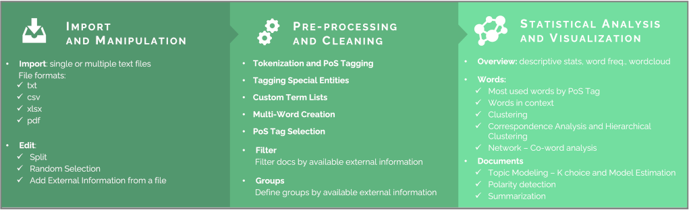

The workflow consists of three main stages:

### 1. Import and Manipulation

TALL supports multiple input formats (plain text, CSV, Excel, PDF,
Biblioshiny exports) and provides tools for corpus splitting, random
sampling, and integration of external metadata. Analysis sessions can be
saved and reloaded as `.tall` files for full reproducibility.

### 2. Pre-processing and Cleaning

Linguistic pre-processing is powered by **UDPipe** with updated
Universal Dependencies v2.15 language models, supporting 60+ languages.
The pre-processing pipeline includes:

- **Tokenization** — splitting raw text into words and sentences
- **Lemmatization** — reducing words to their dictionary base form
- **Part-of-Speech tagging** — assigning grammatical categories (noun,
  verb, adjective, etc.)
- **Dependency parsing** — identifying syntactic relationships between
  words
- **Special entity detection** — tagging emails, URLs, hashtags,
  mentions, emojis, and IP addresses
- **Multi-word expression extraction** — six methods including syntactic
  dependency parsing, RAKE, PMI, Mutual Dependency, Log-Frequency Biased
  MD, and IS Index
- **Custom term lists and synonym merging** — domain-specific vocabulary
  management

### 3. Statistical Text Analysis and Dynamic Visualization

TALL offers a rich set of analytical methods organized across three
sections: **Overview**, **Words**, and **Documents**.

------------------------------------------------------------------------

## Analytical Methods

### Overview

Corpus-level descriptive statistics provide a quantitative profile of
the text collection:

- **Corpus metrics** — document count, tokens, types, lemmas, sentences,
  with averages and standard deviations
- **Lexical richness indices** — Type-Token Ratio (TTR), Hapax Legomena,
  Guiraud Index, Yule’s K
- **Stylistic indices** — Lexical Density, Nominal Ratio, Gini Index
- **Frequency distributions** — word frequency, TF-IDF rankings, Zipf’s
  law visualization, word clouds
- **Morphological features** — distribution of grammatical features
  (Tense, Mood, Number, Person, VerbForm, Degree, Gender, Case, Voice)
  extracted from Universal Dependencies annotation
- **Dependency tree viewer** — interactive visualization of syntactic
  parse trees for individual sentences, with color-coded Part-of-Speech
  tags and labeled dependency arcs

### Words

Word-level analyses reveal the internal structure and thematic
organization of the corpus:

- **Keyness analysis** — statistical comparison of word frequencies
  across groups using Chi-squared and Log-Likelihood Ratio tests, with
  frequency-context plots and word clouds
- **Words in Context (KWIC)** — concordance analysis with customizable
  context windows, co-occurrence network visualization, and distribution
  insights
- **Correspondence Analysis** — factorial mapping of word-document
  associations with hierarchical clustering and dimensional
  interpretation
- **Co-occurrence Network** — weighted word co-occurrence networks with
  multiple normalization indices (Association, Jaccard, Inclusion,
  Salton, Equivalence), Louvain community detection, and adjustable
  community repulsion for visual cluster separation
- **Thematic Map** — strategic diagram positioning topics along Callon’s
  Centrality and Density dimensions (motor themes, basic themes, niche
  themes, emerging/declining themes)
- **Word Embeddings** — Word2Vec model training with similarity network
  analysis, UMAP dimensionality reduction, and cluster-based semantic
  exploration

### Documents

Document-level analyses operate on entire texts and their structural
properties:

- **Topic Modeling** — Latent Dirichlet Allocation (LDA), Correlated
  Topic Models (CTM), and Structural Topic Models (STM), with automated
  K selection using four complementary metrics (CaoJuan 2009, Arun 2010,
  Deveaud 2014, Perplexity/Lower Bound), consensus recommendation, model
  diagnostics, and covariate effects analysis
- **Syntactic Complexity** — dependency-based metrics including Mean
  Dependency Distance (Liu, 2008), parse tree depth, clauses per
  sentence, subordination ratio, and branching factor, computed per
  document with corpus-level summaries and distribution plots
- **SVO Triplet Extraction** — Subject-Verb-Object relationship
  extraction using dependency parsing, with frequency tables, Sankey
  flow diagrams, and verb frequency analysis for content and narrative
  structure analysis
- **Polarity Detection** — lexicon-based sentiment analysis with
  contextual valence shifters (negators, amplifiers, diminishers),
  supporting Hu & Liu, Loughran & McDonald, and NRC lexicons.
  Document-level polarity scoring with distribution visualization
- **Emotion Analysis** — eight-emotion detection (Anger, Anticipation,
  Disgust, Fear, Joy, Sadness, Surprise, Trust) using the NRC
  Word-Emotion Association Lexicon (EmoLex), with emotion distribution
  charts, radar plots, per-document heatmaps, and top contributing words
  per emotion
- **Text Summarization** — extractive summarization via the TextRank
  algorithm (graph-based sentence ranking with PageRank scoring), and
  abstractive summarization powered by Google Gemini AI

### TALL AI

TALL integrates **Google Gemini AI** as an intelligent assistant that
provides automated interpretation of analytical results. Available
across most analysis tabs (Overview, KWIC, Correspondence Analysis,
Co-occurrence Network, Thematic Map, Word Embeddings, Topic Modeling,
Polarity Detection, Emotion Analysis, Syntactic Complexity, SVO
Triplets), TALL AI examines the visual and numerical outputs and
generates contextual, academically-grounded interpretations. AI calls
run asynchronously, keeping the application responsive during
processing.

### Reporting

All analyses can be exported to an Excel workbook with embedded plots,
enabling reproducible reporting. Individual plots can be exported as
high-resolution PNG images with configurable DPI settings. Network
visualizations use native canvas capture for crisp, DPI-aware rendering.

------------------------------------------------------------------------

## Screenshots

### Import text from multiple file formats

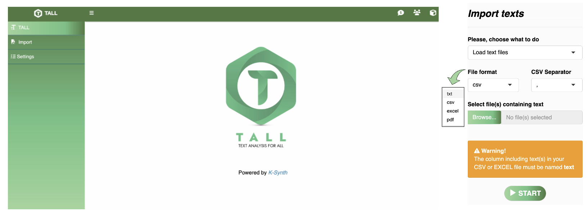

### Edit, divide, and add external information

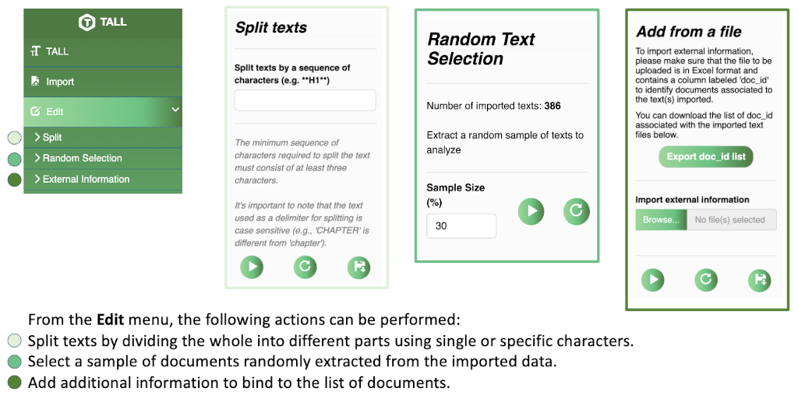

### Automatic Lemmatization and PoS-Tagging

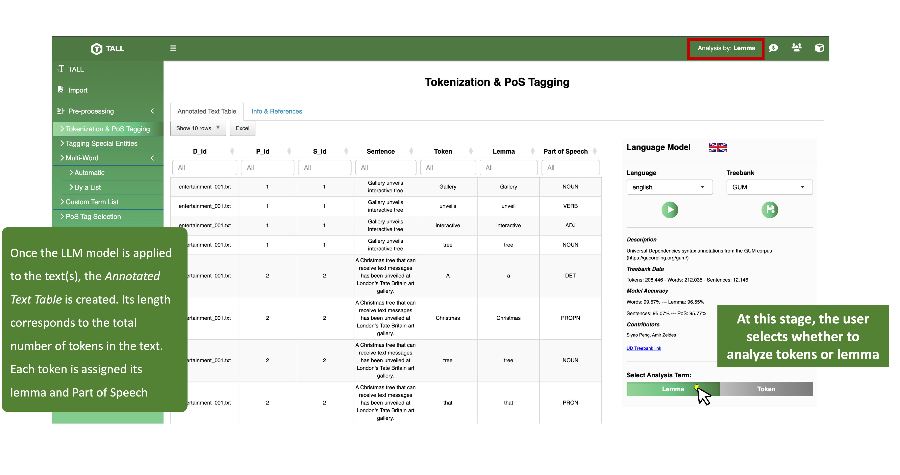

### Language, Model, and Analysis Term Selection


### Special Entity Tagging

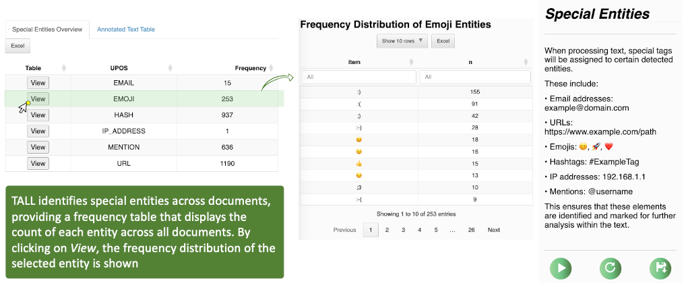
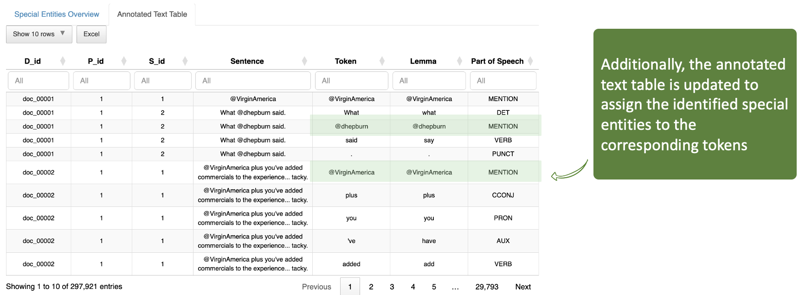

### Multi-word Expression Extraction

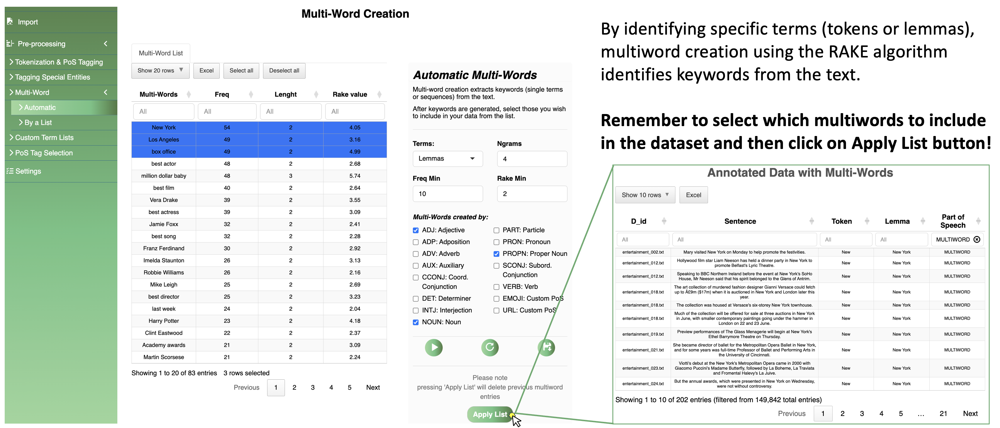 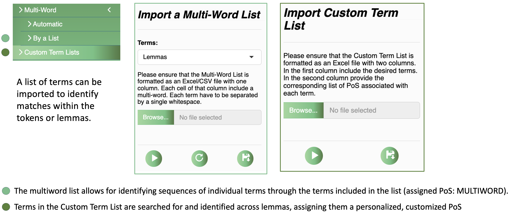

### Overview — Descriptive statistics, concordance analysis, word frequency distributions

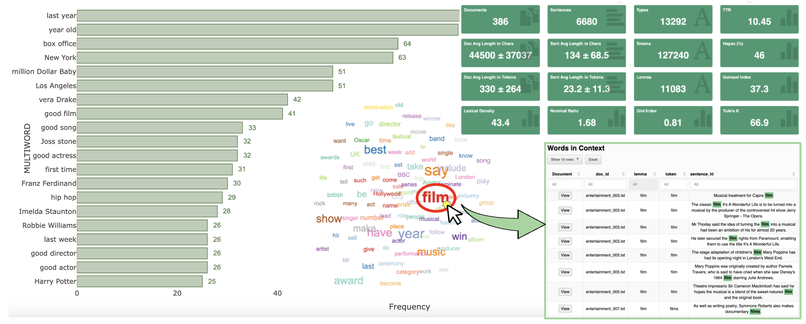

### Words — Topic detection, correspondence analysis, co-occurrence networks

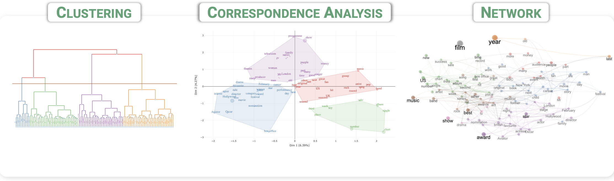

### Documents — Topic modeling, sentiment analysis, syntactic analysis

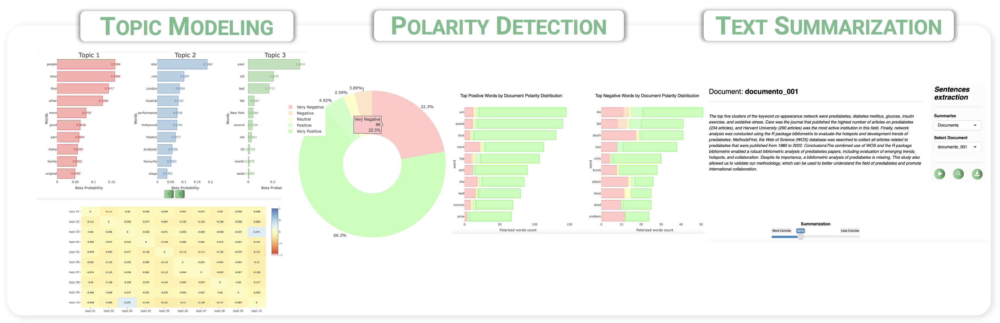

------------------------------------------------------------------------

## Authors

### Creators

- **Massimo Aria** — University of Naples Federico II
  - email: <aria@unina.it> \| ORCID:
    [0000-0002-8517-9411](https://orcid.org/0000-0002-8517-9411)
- **Maria Spano** — University of Naples Federico II
  - email: <maria.spano@unina.it> \| ORCID:
    [0000-0002-3103-2342](https://orcid.org/0000-0002-3103-2342)
- **Luca D’Aniello** — University of Naples Federico II
  - email: <luca.daniello@unina.it> \| ORCID:
    [0000-0003-1019-9212](https://orcid.org/0000-0003-1019-9212)
- **Corrado Cuccurullo** — University of Campania Luigi Vanvitelli
  - email: <corrado.cuccurullo@unicampania.it> \| ORCID:
    [0000-0002-7401-8575](https://orcid.org/0000-0002-7401-8575)

### Contributors

- **Michelangelo Misuraca** — University of Salerno
  - email: <mmisuraca@unisa.it> \| ORCID:
    [0000-0002-8794-966X](https://orcid.org/0000-0002-8794-966X)

### Maintainer

Massimo Aria (<aria@unina.it>)

------------------------------------------------------------------------

## License

MIT License. Copyright 2023-2026 Massimo Aria.

See [LICENSE](LICENSE) for details.
